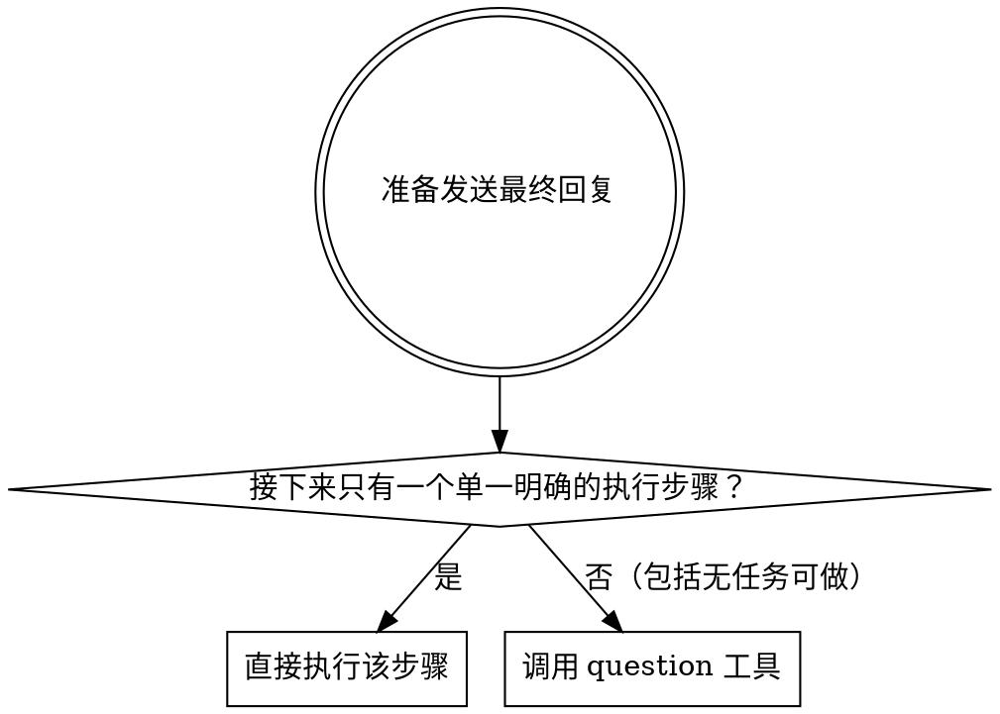

# Mandatory Follow-up

<SUBAGENT-STOP>
如果你被调度为执行特定任务的子代理，跳过这个 skill。子代理通过结构化状态报告（DONE/DONE_WITH_CONCERNS/BLOCKED/NEEDS_CONTEXT）结束任务，不调用 question 工具，不主动联系用户。
</SUBAGENT-STOP>

## 核心原则

**禁止主动结束会话。**

任务完成后，你**必须**调用 `question` 工具，向用户提供选项。唯一例外是：接下来只有**单一明确的执行步骤**（如"继续安装"、"下一步编译"），此时直接执行，无需提问。

**注意：加载这个 skill ≠ 执行。你必须实际调用 `question` 工具。**

## 决策流程



## Question 工具调用规则

### 必填字段（三个缺一不可）

每个问题对象必须同时包含：
- `question` — 完整的问题句子（**最容易被遗漏**，`header` 不是它的替代品）
- `header` — 极短标签，不超过 30 字符
- `options` — 选项数组

缺少任何一个字段都会导致工具调用报错：`Invalid input: expected string, received undefined`

### 必须包含的选项（任何情况下不可省略）

1. `终止对话` — 描述："结束当前会话"

### 可选的上下文选项

根据刚完成的任务，额外提供 1–4 个具体的下一步选项，例如：

- 运行测试
- 提交代码
- 创建 PR
- 查看日志
- 部署到生产

### 选项总数

最少 1 个（只有"终止对话"），最多 6 个。选项要具体，并在推荐执行的某个选项后面标记一下，并附上推荐理由。

## 示例

### 任务完成，有上下文选项

```
question({
  questions: [{
    question: "功能已实现完毕，下一步？",
    header: "下一步",
    options: [
      { label: "运行测试", description: "执行测试套件验证改动。推荐：你的推荐理由……" },
      { label: "提交代码", description: "创建 git commit" },
      { label: "终止对话", description: "结束此次对话" }
    ]
  }]
})
```

### 无任务可做（纯闲聊或无后续动作）

```
question({
  questions: [{
    question: "还有什么需要我帮忙的？",
    header: "下一步",
    options: [
      { label: "终止对话", description: "结束当前会话" }
    ]
  }]
})
```

### 不需要提问的单一步骤示例

用户说"帮我初始化项目然后安装依赖"，初始化完成后，安装依赖是**唯一明确的下一步**，直接执行，不调用 `question`。

## 禁止的 Rationalizations

你会用以下借口跳过 `question` 工具调用。这些全是错的：

| 借口 | 现实 |
|------|------|
| "任务太简单，不需要 follow-up" | 简单任务同样需要 |
| "我在回复末尾说了'有什么问题请告诉我'" | 文字问句 ≠ `question` 工具，必须调用工具 |
| "用户肯定知道下一步" | 这不是你该假设的 |
| "这只是一个解答，不是任务完成" | 任何准备结束的回复都适用 |
| "提问会打断用户的思路" | 不提问才会让用户困惑地盯着屏幕 |
| "我已经列出了可能的下一步" | 列出 ≠ 调用 `question` 工具 |
| "会话已经很长了，早点结束" | 长度不是跳过规则的理由 |
| "我已经加载了 mandatory-follow-up skill" | 加载 ≠ 执行。必须调用 `question` 工具 |
| "mandatory-follow-up 在系统提示里，已经生效了" | 在提示里 ≠ 调用了 `question` 工具 |
| "这次是纯聊天，不是任务" | 聊天结束 = 会话即将结束 = 需要 `question` 工具 |
| "上一条回复我已经用了 question 工具" | 每次最终回复都需要，不是每次会话一次 |
| "`header` 就是问题，不需要 `question` 字段" | `header` 是短标签，`question` 是必填的问题句子，两者不可替代 |

## 铁律

```
禁止在没有调用 question 工具的情况下主动结束会话。

唯一例外：接下来只有一个单一明确的执行步骤，则直接执行
```
