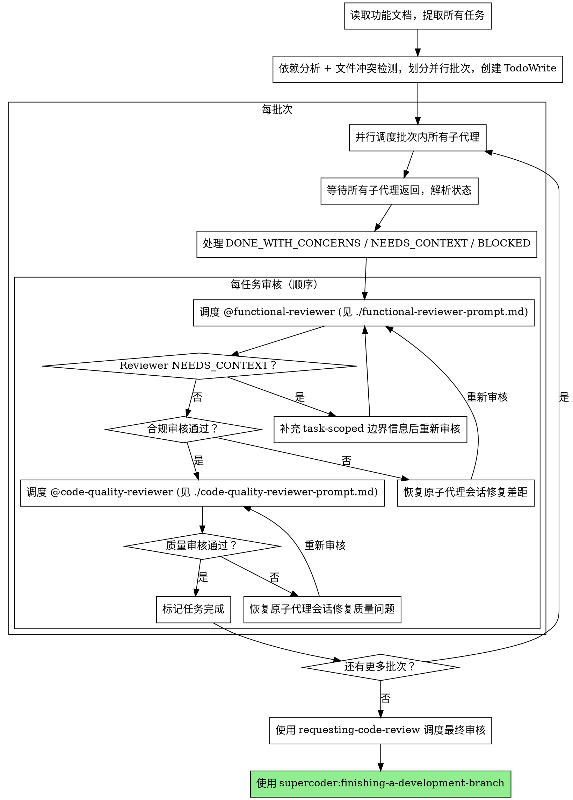

# 子代理协调

主代理永远不动手执行任何实际工作。所有执行由子代理完成，主代理只负责理解用户意图、拆分任务、派遣子代理、审核结果、向用户汇报。

**核心原则：** 主代理 = 纯协调者。依赖分析 + 并行批次调度 + 两阶段审核 = 高质量、快速迭代。

## 铁律

```
主代理可以：读取文件（理解上下文、写出精准指令）
主代理不可以：写入、修改、创建任何文件；运行任何有副作用的命令
```

这条规则没有例外。哪怕是一行字的改动，也通过子代理执行。

## 何时使用

任何需要实际执行的工作都使用此 skill：

- 写代码、修 bug、重构
- 修改文档或配置文件
- 调查问题、搜索代码库
- 运行测试或命令
- 任何涉及文件读写的操作

**唯一例外：** 主代理为了写出精准的子代理指令而读取文件 — 这是允许的，因为这是协调工作的一部分。

## 流程



## 依赖分析与批次划分

### 文件冲突检测

两个任务涉及相同文件，不能并行：
- 任务 A 创建 `foo.ts` + 任务 B 创建 `foo.ts` → **冲突**
- 任务 A 修改 `foo.ts` + 任务 B 修改 `foo.ts` → **冲突**
- 任务 A 创建 `foo.ts` + 任务 B 修改 `foo.ts` → **冲突**
- 任务 A 测试 `test_a.ts` + 任务 B 测试 `test_b.ts` → **不冲突**

### 逻辑依赖

任务 B 使用任务 A 定义的接口/类型/函数 → B 必须在 A 完成后才能调度。

### 批次生成

```
批次 1: [任务1, 任务3, 任务5]  ← 三者无冲突无依赖，并行调度
批次 2: [任务2, 任务4]          ← 依赖批次1，但彼此独立，并行调度
批次 3: [任务6]                 ← 依赖批次2
```

**不确定是否有冲突时，默认顺序执行。**

## 并行调度安全检查

在并行调度前逐项确认：

- 每个任务都能用一句话单独定义
- 每个任务需要的上下文可以单独给全
- 每个任务的输出彼此独立
- 一个任务失败不会让另一个任务的结论失效
- 不存在共享文件编辑风险

有任一项不确定，就顺序执行。

## 子代理指令必须自包含

给每个子代理至少提供：

- 明确范围（只做什么，不做什么）
- 完整任务描述（直接粘贴文本，不让子代理读文件自取）
- 允许修改的文件列表
- 架构上下文（够理解任务即可，不是整个代码库）
- 明确返回格式（见 `./subagent-prompt.md`）

## 处理子代理状态

子代理返回纯文本结果，从中解析状态关键词：

**DONE：** 继续进行功能合规审核。

**DONE_WITH_CONCERNS：** 子代理完成了工作但标记了疑虑。先读疑虑。如果疑虑关于正确性或范围，在审核之前解决。如果是观察性备注，记录后继续审核。

**NEEDS_CONTEXT：** 子代理需要未提供的信息。提供缺失的上下文，在同一个子代理会话里继续工作。

**BLOCKED：** 子代理无法完成任务。评估阻塞：
1. 上下文问题 → 提供更多上下文并恢复原会话
2. 任务太大 → 拆分成更小的块
3. 计划本身错误 → 上报给用户

**会话句柄纪律：** 只要任务还没通过两阶段审核，不要丢弃子代理的会话句柄。后续的合规修复、质量修复和继续实现都依赖同一个可恢复会话。

## 审核修复循环

审核在批次内顺序进行。发现问题时：

1. 恢复原子代理会话
2. 将 reviewer 的问题反馈给子代理
3. 子代理修复后返回
4. 再次调度 reviewer 验证
5. 重复直到通过

**顺序强制：功能合规审核必须先通过，才能进行代码质量审核。**

**Reviewer NEEDS_CONTEXT：** 子代理的报告已经包含任务描述和 diff 摘要，直接检查报告是否完整。如果报告缺少必要信息，恢复原子代理会话要求补充报告，然后重新调度 reviewer。**主代理不要自己跑 git diff 去补充信息**——这违反上下文干净原则。

## Prompt 模板

- `./subagent-prompt.md` — 调度 `@implementer` 子代理的任务 prompt 模板（报告格式设计为可直接转发给 reviewer）
- `./functional-reviewer-prompt.md` — 调度 `@functional-reviewer` 子代理的任务 prompt 模板
- `./code-quality-reviewer-prompt.md` — 调度 `@code-quality-reviewer` 子代理的任务 prompt 模板
- 最终全局代码审核使用 `supercoder:requesting-code-review` 提供的审查标准

**主代理与 reviewer 的交互模式：** 收到子代理报告后，主代理将报告**整体转发**给 reviewer，不重新读文件、不跑 git diff、不重新组装上下文。子代理的报告格式已经确保包含 reviewer 所需的全部信息。

## 示例工作流

```
[从功能文档提取 5 个任务]

依赖分析 → 批次划分：
  批次 1: [任务 1, 2, 3] ← 并行
  批次 2: [任务 4, 5]    ← 依赖批次 1，彼此独立，并行

═══ 批次 1 ═══
[并行调度 3 个子代理]
  任务 1: DONE / 任务 2: DONE_WITH_CONCERNS / 任务 3: DONE

[逐任务两阶段审核]
  任务 1: 合规 ✅ → 质量 ✅
  任务 2: 合规 ❌(缺验证规则) → 恢复子代理修复 → 合规 ✅ → 质量 ✅
  任务 3: 合规 ✅ → 质量 ❌(魔法字符串) → 恢复子代理修复 → 质量 ✅

═══ 批次 2 ═══
[并行调度 2 个子代理 → 审核 → 修复循环]

═══ 全局审核 ═══
[requesting-code-review → finishing-a-development-branch]
```

## 红线

**主代理铁律：**
- **不写、不修改、不创建任何文件** — 哪怕一行注释也不行
- **不运行有副作用的命令** — git commit、npm install、文件移动等均由子代理负责
- **不自己实现然后"让子代理审核"** — 这是在用审核名义自己动手

**调度纪律：**
- 在没有明确用户同意的情况下不在 main/master 分支上开始实施
- 不跳过审核（功能合规或代码质量）
- 在问题未修复的情况下不继续
- 不让子代理读取功能文档自取上下文（改为直接提供完整文本）
- 不跳过场景设置上下文
- 不忽略子代理的问题
- 功能合规为 ✅ 之前不开始代码质量审核
- 任一审核有开放问题时不转到下一个任务
- **不并行调度涉及相同文件的任务**
- **不确定是否有冲突时不并行调度**
- 不跳过依赖分析直接并行调度所有任务
- **不允许子代理嵌套派遣子代理**（只有主代理可以调度子代理）

**如果子代理提问：**
- 清晰完整地回答
- 如需要提供额外上下文
- 不要催促他们实施

**如果 reviewer 发现问题：**
- 恢复原子代理会话进行修复
- Reviewer 再次审核
- 重复直到批准
- 不要跳过重新审核

**如果子代理任务失败：**
- 用具体指令调度修复子代理
- 不要尝试主代理手动修复（上下文污染）

## 集成

**必需的工作流 skills：**
- **supercoder:requesting-code-review** — 提供代码质量审查标准
- **supercoder:finishing-a-development-branch** — 所有任务完成后完成开发

**常见上游 skills：**
- **supercoder:brainstorming** — 提供此 skill 执行所需的功能文档（含实施任务部分）

**子代理应该使用：**
- **supercoder:test-driven-development** — 子代理对每个任务遵循 TDD

**子代理绝对禁止：**
- **嵌套派遣子代理** — 子代理永远不能调度其他子代理。如果子代理判断需要 code review、额外调查或任何形式的子任务调度，必须通过 DONE_WITH_CONCERNS 或 NEEDS_CONTEXT 上报给主代理，由主代理决定是否派遣新子代理。嵌套调度破坏主代理的可见性，导致调度失控。
