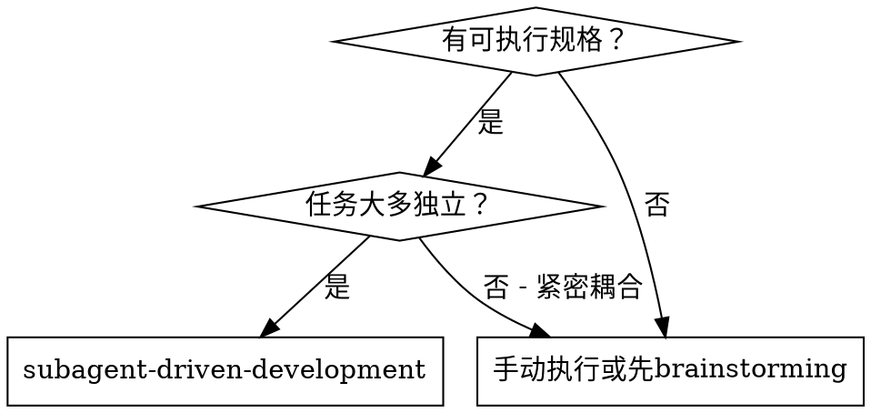
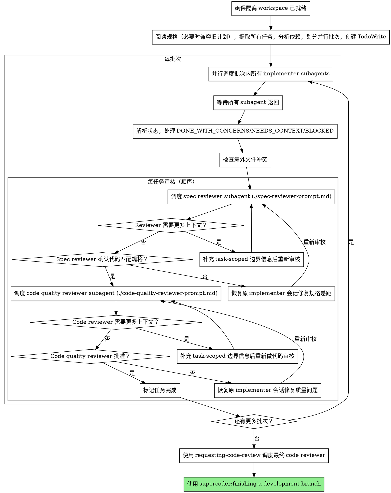

# Subagent 驱动开发

通过为每个任务调度新的 subagent 来执行可实施规格。通常任务直接写在规格中；历史仓库里也可能存在旧的计划文档。独立任务并行调度以提高效率，每个任务完成后进行两阶段审核：首先进行规格合规审核，然后进行代码质量审核。

**为什么 subagents：** 你将任务委托给具有隔离上下文的专用 agent。通过精心设计它们的指令和上下文，你确保它们保持专注并成功完成它们的任务。它们永远不应该继承你的会话的上下文或历史——你构建它们正好需要的东西。这也为你自己保留用于协调工作的上下文。

**核心原则：** 依赖分析 + 并行批次调度 + 两阶段审核（先规格后质量）= 高质量、快速迭代

## 何时使用


- 同一会话（无上下文切换）
- 每个任务一个新 subagent（无上下文污染）
- 独立任务并行调度（提高效率）
- 每个任务后两阶段审核：先规格合规，后代码质量
- 更快迭代（任务之间无人参与循环）

## 流程



## 依赖分析与批次划分

开始前先确保有隔离 workspace。后续所有任务调度、验证和审核都在该隔离 workspace 内运行。

Controller 先阅读规格，并从规格正文或其中的实施任务部分提取任务列表，再做依赖分析和批次划分。只有在处理历史仓库时，才兼容读取旧的计划文档。

### 文件冲突检测

两个任务如果涉及相同文件，不能并行：
- 任务 A 创建 `foo.ts` + 任务 B 创建 `foo.ts` → **冲突**
- 任务 A 修改 `foo.ts` + 任务 B 修改 `foo.ts` → **冲突**
- 任务 A 创建 `foo.ts` + 任务 B 修改 `foo.ts` → **冲突**
- 任务 A 测试 `test_a.ts` + 任务 B 测试 `test_b.ts` → **不冲突**

### 逻辑依赖

如果任务 B 使用任务 A 定义的接口/类型/函数，B 必须在 A 完成后才能调度。

### 批次生成

将无冲突、无依赖的任务分入同一批次：
```
批次 1: [任务1, 任务3, 任务5]  ← 三者无冲突无依赖，并行调度
批次 2: [任务2, 任务4]          ← 依赖批次1，但彼此独立，并行调度
批次 3: [任务6]                 ← 依赖批次2
```

**不确定是否有冲突时，默认顺序执行。**

## 处理 Implementer 状态

OpenCode 子智能体会话返回纯文本结果。Controller 在启动 implementer 时必须保留可恢复该会话的会话句柄，并从返回文本中解析状态关键词：

**DONE：** 继续进行规格合规审核。

**DONE_WITH_CONCERNS：** Implementer 完成了工作但标记了疑虑。在继续之前阅读疑虑。如果疑虑关于正确性或范围，在审核之前解决它们。如果它们是观察（例如，"这个文件变得太大了"），记录它们并继续审核。

**NEEDS_CONTEXT：** Implementer 需要未提供的信息。提供缺失的上下文，并在同一个 implementer 会话里继续工作。

**BLOCKED：** Implementer 无法完成任务。评估阻塞：
1. 如果是上下文问题，提供更多上下文并恢复原会话
2. 如果任务太大，分解成更小的块
3. 如果计划本身是错误的，升级给人类

**Controller 句柄纪律：** 只要任务还没通过两阶段审核，就不要丢弃 implementer 的会话句柄。后续的规格修复、质量修复和继续实现都依赖同一个可恢复会话。

**永远不要**忽略升级或强制重试而没有更改。如果 implementer 说它卡住了，需要改变。

## 审核修复循环

审核在批次内顺序进行。当 reviewer 发现问题时：

1. 恢复原 implementer subagent 会话
2. 将 reviewer 的问题反馈给 implementer
3. Implementer 修复后返回
4. 再次调度 reviewer 验证修复
5. 重复直到通过

**顺序：spec 合规审核必须先通过，然后才能进行 code quality 审核。**

**Reviewer NEEDS_CONTEXT：** 如果 reviewer 报告 `NEEDS_CONTEXT`，不要继续做 pass/fail 判断。补充任务边界信息（任务级 diff hunk、精确变更范围、共享文件里的相关片段）后，重新调度同类 reviewer。只有 reviewer 明确能隔离当前任务时，审核结果才有效。

Controller 给 reviewer 的上下文必须自包含：传入任务完整文本、implementer 报告，以及该任务实际修改的文件列表；对任何可能混入其他任务或预存改动的共享文件，还必须补充 task-scoped diff hunk 或精确变更范围。不要只给计划文件路径，也不要让 reviewer 通过整个 workspace 或整条分支的 diff 去猜任务边界。若边界仍不清楚，reviewer 必须请求更多上下文，而不是猜测。

## 提示模板

- `./implementer-prompt.md` - 调度 implementer subagent
- `./spec-reviewer-prompt.md` - 调度规格合规审核 subagent
- `./code-quality-reviewer-prompt.md` - 调度代码质量审核 subagent
- 最终全局代码审核使用 `supercoder:requesting-code-review` 提供的审查模板和标准

## 示例工作流

```
[阅读计划，提取 5 个任务]

依赖分析 → 批次划分：
  批次 1: [任务 1, 2, 3] ← 并行
  批次 2: [任务 4, 5]    ← 依赖批次 1，彼此独立，并行

═══ 批次 1 ═══
[并行调度 3 个 implementer subagents]
  任务 1: DONE / 任务 2: DONE_WITH_CONCERNS / 任务 3: DONE

[逐任务两阶段审核]
  任务 1: spec ✅ → quality ✅
  任务 2: spec ❌(缺验证规则) → 恢复implementer修复 → spec ✅ → quality ✅
  任务 3: spec ✅ → quality ❌(魔法字符串) → 恢复implementer修复 → quality ✅

═══ 批次 2 ═══
[并行调度 2 个 implementer subagents → 审核 → 修复循环]

═══ 全局审核 ═══
[requesting-code-review → finishing-a-development-branch]
```

## 红线

**永远不要：**
- 在没有明确用户同意的情况下在 main/master 分支上开始实施
- 跳过审核（规格合规或代码质量）
- 在问题未修复的情况下继续
- 让 subagent 阅读计划文件（改为提供完整文本）
- 跳过场景设置上下文（subagent 需要理解任务在哪里）
- 忽略 subagent 问题（在他们继续之前回答）
- 在规格合规上接受"差不多"（spec reviewer 发现问题 = 未完成）
- 跳过审核循环（reviewer 发现问题 = implementer 修复 = 再次审核）
- 让 implementer 自审取代实际审核（两者都需要）
- **在规格合规为 ✅ 之前开始代码质量审核**（顺序错误）
- 当任一审核有开放问题时转到下一个任务
- **并行调度涉及相同文件的任务**（冲突风险）
- **不确定是否有冲突时仍然并行调度**（默认顺序）
- 跳过依赖分析直接并行调度所有任务
- **允许 subagent 嵌套派遣子代理**（只有 controller 可以调度 subagent）

**如果 subagent 提问：**
- 清晰完整地回答
- 如需要提供额外上下文
- 不要催促他们实施

**如果 reviewer 发现问题：**
- 恢复原 implementer 会话进行修复
- Reviewer 再次审核
- 重复直到批准
- 不要跳过重新审核

**如果 subagent 任务失败：**
- 用特定指令调度修复 subagent
- 不要尝试手动修复（上下文污染）

## 集成

**必需的工作流 skills：**
- **supercoder:requesting-code-review** - 提供代码质量审查标准的参考
- **supercoder:finishing-a-development-branch** - 所有任务完成后完成开发

**常见上游 skills：**
- **supercoder:brainstorming** - 提供此 skill 执行所需的规格输入（规格可含实施任务部分）

**参考 skills：**
- **supercoder:dispatching-parallel-agents** - 并行调度的模式参考

**Subagents 应该使用：**
- **supercoder:test-driven-development** - Subagents 对每个任务遵循 TDD

**Subagents 绝对禁止：**
- **嵌套派遣子代理** - Subagent 永远不能调度其他 subagent。如果 subagent 判断需要 code review、额外调查或任何形式的子任务调度，必须通过 DONE_WITH_CONCERNS 或 NEEDS_CONTEXT 上报给 controller，由 controller 决定是否派遣新 subagent。嵌套调度会破坏 controller 的可见性，导致调度失控。
