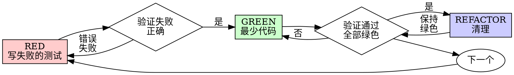

# test-driven-development (TDD)

## 概述

先写测试。看到它失败。写最少的代码通过。

**核心原则：** 如果你没有看到测试失败，你就不知道它是否测试了正确的东西。

**违反规则的字面就是违反规则的精神。**

## 何时使用

**始终：**
- 新功能
- Bug 修复
- 重构
- 行为更改

**例外（询问你的 human partner）：**
- 一次性原型
- 生成代码
- 配置文件

认为"这次跳过 TDD"？停止。那是合理化。

## 铁律

```
没有先失败的测试就不能写生产代码
```

在测试之前写代码？删除它。重新开始。

**没有例外：**
- 不要保留它作为"参考"
- 不要在写测试时"适应"它
- 不要看它
- 删除意味着删除

从测试重新开始。就是这样。

## 红-绿-重构



### RED - 写失败的测试

写一个最小的测试，显示应该发生的事情。

<好>
```typescript
test('重试失败的操作 3 次', async () => {
  let attempts = 0;
  const operation = () => {
    attempts++;
    if (attempts < 3) throw new Error('fail');
    return 'success';
  };

  const result = await retryOperation(operation);

  expect(result).toBe('success');
  expect(attempts).toBe(3);
});
```
清晰名称，测试真实行为，一件事
</好>

<坏>
```typescript
test('重试有效', async () => {
  const mock = jest.fn()
    .mockRejectedValueOnce(new Error())
    .mockRejectedValueOnce(new Error())
    .mockResolvedValueOnce('success');
  await retryOperation(mock);
  expect(mock).toHaveBeenCalledTimes(3);
});
```
模糊名称，测试 mock 而不是代码
</坏>

**要求：**
- 一个行为
- 清晰名称
- 真实代码（除非不可避免，否则不用 mocks）

### 验证 RED - 看到它失败

**强制。永远不要跳过。**

```bash
npm test path/to/test.test.ts
```

确认：
- 测试失败（不是错误）
- 失败消息符合预期
- 失败是因为功能缺失（不是拼写错误）

**测试通过？** 你在测试现有行为。修复测试。

**测试错误？** 修复错误，重新运行直到正确失败。

### GREEN - 最少代码

写最简单的代码来通过测试。

<好>
```typescript
async function retryOperation<T>(fn: () => Promise<T>): Promise<T> {
  for (let i = 0; i < 3; i++) {
    try {
      return await fn();
    } catch (e) {
      if (i === 2) throw e;
    }
  }
  throw new Error('unreachable');
}
```
刚好通过
</好>

<坏>
```typescript
async function retryOperation<T>(
  fn: () => Promise<T>,
  options?: {
    maxRetries?: number;
    backoff?: 'linear' | 'exponential';
    onRetry?: (attempt: number) => void;
  }
): Promise<T> {
  // YAGNI
}
```
过度工程
</坏>

不要添加功能、重构其他代码或"改进"超过测试。

### 验证 GREEN - 看到它通过

**强制。**

```bash
npm test path/to/test.test.ts
```

确认：
- 测试通过
- 其他测试仍然通过
- 输出干净（无错误、警告）

**测试失败？** 修复代码，不是测试。

**其他测试失败？** 现在修复。

### REFACTOR - 清理

只在绿色之后：
- 移除重复
- 改进名称
- 提取辅助函数

保持测试绿色。不要添加行为。

### 重复

下一个功能的下一个失败测试。

## 好测试

| 质量 | 好 | 坏 |
|------|-----|-----|
| **最少** | 一件事。名称中有"and"？分开它。 | `test('验证邮箱和域名和空白')` |
| **清晰** | 名称描述行为 | `test('test1')` |
| **显示意图** | 展示期望的 API | 掩盖代码应该做什么 |

## 为什么测试优先

测试在代码之后写会立即通过 —— 立即通过证明不了什么。你可能测试了错误的东西、测试了实现而不是行为、忘记了边缘情况。测试优先迫使你看到失败，证明测试确实在测正确的东西。

## 常见合理化

| 借口 | 现实 |
|------|------|
| "太简单不需要测试" | 简单代码会坏。测试需要 30 秒。 |
| "我稍后测试" | 稍后测试 = "这做什么？" 测试优先 = "这应该做什么？" |
| "已经手动测试" | 随意 ≠ 系统化。无记录，无法重新运行。 |
| "删除 X 小时是浪费" | 沉没成本谬误。保留未验证的代码是技术债务。 |
| "需要先探索" | 可以。丢弃探索，用 TDD 开始。 |
| "TDD 会让我变慢" | TDD 比调试快。 |

**红线 — 看到以下任何一条，删除代码，用 TDD 重新开始：**

代码在测试之前 / 测试立即通过 / 无法解释为什么测试失败 / "就这一次" / "保留作为参考" / "是精神不是仪式" / "TDD 是教条的"

## 示例：Bug 修复

**Bug：** 接受空邮箱

**RED**
```typescript
test('拒绝空邮箱', async () => {
  const result = await submitForm({ email: '' });
  expect(result.error).toBe('需要邮箱');
});
```

**验证 RED**
```bash
$ npm test
FAIL: 期望 '需要邮箱'，得到 undefined
```

**GREEN**
```typescript
function submitForm(data: FormData) {
  if (!data.email?.trim()) {
    return { error: '需要邮箱' };
  }
  // ...
}
```

**验证 GREEN**
```bash
$ npm test
PASS
```

**REFACTOR**
如需要为多个字段提取验证。

## 验证检查清单

在标记工作完成之前：

- [ ] 每个新函数/方法有测试
- [ ] 在实施之前看到每个测试失败
- [ ] 每个测试因预期原因失败（功能缺失，不是拼写错误）
- [ ] 为通过每个测试写最少代码
- [ ] 所有测试通过
- [ ] 输出干净（无错误、警告）
- [ ] 测试使用真实代码（除非不可避免，否则不用 mocks）
- [ ] 覆盖边缘情况和错误

无法勾选所有框？你跳过了 TDD。重新开始。

## 当卡住时

| 问题 | 解决方案 |
|------|----------|
| 不知道怎么测试 | 写期望的 API。先写断言。询问你的 human partner。 |
| 测试太复杂 | 设计太复杂。简化接口。 |
| 必须 mock 一切 | 代码太耦合。使用依赖注入。 |
| 测试设置巨大 | 提取辅助函数。仍然复杂？简化设计。 |

## 调试集成

发现 bug？写重现它的失败测试，遵循 TDD 周期。永远不要在没有测试的情况下修复 bug。添加 mocks 时，阅读 @testing-anti-patterns.md 避免常见陷阱。

## 最终规则

```
生产代码 → 测试存在并首先失败
否则 → 不是 TDD
```

没有你的 human partner 的许可不能有例外。