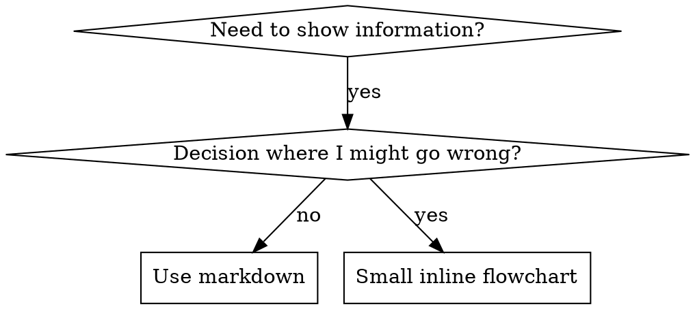

# Writing Skills

## 概述

**编写 skills 就是应用于流程文档的 Test-Driven Development。**

**个人 skills 存放在 OpenCode 的 `~/.config/opencode/skills/` 目录中**

你编写测试用例（带 subagent 的压力场景），观察它们失败（基线行为），编写 skill（文档），观察测试通过（agent 遵守），然后重构（堵住漏洞）。

**核心原则：** 如果你没有观察到 agent 在没有 skill 时失败，你就不知道 skill 是否教了正确的东西。

**REQUIRED BACKGROUND：** 在使用此 skill 之前，你必须理解 supercoder:test-driven-development。该 skill 定义了基本的 RED-GREEN-REFACTOR 循环。此 skill 将 TDD 应用于文档。

**补充参考：** `testing-skills-with-subagents.md`、`persuasion-principles.md` 与 `graphviz-conventions.dot` 提供配套方法与参考。

## 什么是 Skill？

一个 **skill** 是经过验证的技术、模式或工具的参考指南。Skills 帮助未来的 agent 实例找到并应用有效的方法。

**Skills 是：** 可复用的技术、模式、工具、参考指南

**Skills 不是：** 关于你如何一次性解决问题的叙述

## Skills 的 TDD 映射

| TDD 概念 | Skill 创建 |
|---------|----------------|
| **测试用例** | 带 subagent 的压力场景 |
| **生产代码** | Skill 文档（SKILL.md） |
| **测试失败（RED）** | 没有 skill 时 agent 违反规则（基线） |
| **测试通过（GREEN）** | 有 skill 时 agent 遵守 |
| **重构** | 在保持合规的同时堵住漏洞 |
| **先写测试** | 在编写 skill 之前运行基线场景 |
| **观察失败** | 记录 agent 使用的确切 rationalizations |
| **最小代码** | 编写 skill 来解决这些具体违规 |
| **观察通过** | 验证 agent 现在遵守 |
| **重构循环** | 发现新的 rationalizations → 堵住 → 重新验证 |

整个 skill 创建过程遵循 RED-GREEN-REFACTOR。

## 何时创建 Skill

**创建时机：**
- 技术对你来说不是显而易见的
- 你会跨项目再次参考这个
- 模式广泛适用（不是项目特定的）
- 其他人会受益

**不要为以下创建：**
- 一次性解决方案
- 其他地方有良好文档的标准实践
- 项目特定的约定（放在 CLAUDE.md 中）
- 机械约束（如果可以用 regex/验证强制执行，就自动化它 — 将文档留给判断调用）

## Skill 类型

### 技术（Technique）
有具体步骤的具体方法（condition-based-waiting、root-cause-tracing）

### 模式（Pattern）
思考问题的方式（flatten-with-flags、test-invariants）

### 参考（Reference）
API 文档、语法指南、工具文档（office 文档）

## 目录结构

```
skills/
  skill-name/
    SKILL.md              # 主要参考（必需）
    supporting-file.*     # 仅在需要时
```

**扁平命名空间** — 所有 skills 在一个可搜索的命名空间中

**单独文件用于：**
1. **重量级参考**（100+ 行）— API 文档、综合语法
2. **可复用工具** — 脚本、实用工具、模板

**保持内联：**
- 原则和概念
- 代码模式（< 50 行）
- 其他所有内容

## SKILL.md 结构

**Frontmatter（YAML）：**
- 两个必需字段：`name` 和 `description`（有关所有支持字段，请参阅 [agentskills.io/specification](https://agentskills.io/specification)）
- 总共最多 1024 个字符
- `name`：仅使用字母、数字和连字符（不使用括号、特殊字符）
- `description`：第三人称，仅描述何时使用（不是它做什么）
  - 以"Use when..."开头以聚焦于触发条件
  - 包含具体症状、情况和上下文
  - **永远不要总结 skill 的流程或工作流**（请参阅 ASO 部分了解原因）
  - 尽可能保持在 500 个字符以内

```markdown
---
name: Skill-Name-With-Hyphens
description: Use when [具体触发条件和症状]
---

# Skill 名称

## 概述
这是什么？1-2 句话的核心原则。

## 何时使用
[如果决策不明显，小型内联流程图]

带症状和用例的项目符号列表
何时不使用

## 核心模式（用于技术/模式）
前后代码对比

## 快速参考
用于扫描常见操作的表格或项目符号

## 实现
简单模式的内联代码
重量级参考或可复用工具链接到文件

## 常见错误
出错的地方 + 修复方法

## 实际影响（可选）
具体结果
```

## Agent 搜索优化（ASO）

Agent 阅读描述来决定加载哪些 skills。

### 描述字段

**描述 = 何时使用，不是 skill 做什么。** 以"Use when..."开头，聚焦触发条件。

**关键：不要总结 skill 的流程或工作流。** 测试发现，当描述总结工作流时，agent 可能遵循描述而跳过完整 skill 内容。

```yaml
# ❌ 总结工作流 — Agent 会走捷径
description: Use for TDD - write test first, watch it fail, write minimal code, refactor

# ✅ 仅触发条件
description: Use when implementing any feature or bugfix, before writing implementation code
```

**内容要求：**
- 具体触发器、症状和情况
- 描述问题而不是语言特定症状
- 第三人称（注入到系统提示中）
- 尽可能 <500 字符

### 关键词覆盖

使用 agent 会搜索的词：错误消息、症状（"flaky"、"hanging"、"zombie"）、同义词、工具名称。

### 命名

- 动词优先，主动语态：`condition-based-waiting` > `async-test-helpers`
- 动名词适合流程：`creating-skills`、`debugging-with-logs`

### Token 效率

getting-started 工作流 <150 字，频繁加载 skills <200 字，其他 <500 字。
- 将细节移到 `--help`，不要在 SKILL.md 中列举所有标志
- 交叉引用其他 skills 而不是重复内容
- 一个好示例胜过多个平庸示例

### 交叉引用

仅用 skill 名称 + 明确需求标记。不要用 `@` 链接（强制加载消耗上下文）。

```markdown
# ✅ 好
**REQUIRED BACKGROUND:** supercoder:test-driven-development
# ❌ 差
@skills/testing/test-driven-development/SKILL.md
```

## 流程图使用



**仅在以下情况使用流程图：**
- 非显而易见的决策点
- 你可能过早停止的流程循环
- "何时使用 A 而不是 B"的决策

**永远不要使用流程图用于：**
- 参考材料 → 表格、列表
- 代码示例 → Markdown 块
- 线性说明 → 编号列表
- 没有语义意义的标签（step1、helper2）

请参阅 @graphviz-conventions.dot 获取 graphviz 样式规则。

**为你的 human partner 可视化：** 使用此目录中的 `render-graphs.js` 将 skill 的流程图渲染为 SVG：
```bash
./render-graphs.js ../some-skill           # 每个图表分开
./render-graphs.js ../some-skill --combine # 所有图表在一个 SVG 中
```

## 代码示例

**一个优秀的示例胜过许多平庸的**

选择最相关的语言：
- 测试技术 → TypeScript/JavaScript
- 系统调试 → Shell/Python
- 数据处理 → Python

**好的示例：**
- 完整且可运行
- 有良好注释，解释 WHY
- 来自真实场景
- 清晰展示模式
- 准备好适配（不是通用模板）

**不要：**
- 用 5+ 种语言实现
- 创建填空模板
- 编写人为的示例

你擅长移植 — 一个很好的示例就足够了。

## 文件组织

### 自包含 Skill
```
defense-in-depth/
  SKILL.md    # 全部内联
```
何时：所有内容都适合，不需要重量级参考

### 带可复用工具的 Skill
```
condition-based-waiting/
  SKILL.md    # 概述 + 模式
  example.ts  # 可适配的工作助手
```
何时：工具是可复用的代码，不仅仅是叙述

### 带重量级参考的 Skill
```
pptx/
  SKILL.md       # 概述 + 工作流
  pptxgenjs.md   # 600 行 API 参考
  ooxml.md       # 500 行 XML 结构
  scripts/       # 可执行工具
```
何时：参考材料太大，无法内联

## 铁律（与 TDD 相同）

```
没有失败的测试就没有 Skill
```

这适用于新 skills 和对现有 skills 的编辑。

先写 skill 后测试？删掉它。重新开始。
编辑 skill 而不测试？同样的违规。

**没有例外：**
- 不适用于"简单添加"
- 不适用于"只是添加一个部分"
- 不适用于"文档更新"
- 不要将未测试的更改保留为"参考"
- 不要在运行测试时"适配"
- 删除就是删除

**REQUIRED BACKGROUND：** supercoder:test-driven-development skill 解释了为什么这很重要。相同的原则适用于文档。

## 测试不同 Skill 类型

| 类型 | 示例 | 测试重点 | 成功标准 |
|------|------|----------|----------|
| **纪律执行型** | TDD, verification | 压力场景（时间+沉没成本+疲劳）,识别 rationalizations | 最大压力下仍遵循规则 |
| **技术型** | condition-based-waiting | 应用场景、边缘情况、缺失信息 | 成功应用于新场景 |
| **模式型** | reducing-complexity | 识别、应用、反例 | 正确识别何时/如何应用 |
| **参考型** | API 文档 | 检索、应用、间隙 | 找到并正确应用信息 |

## 跳过测试的常见 Rationalizations

| 借口 | 现实 |
|--------|---------|
| "Skill 很明显" | 对你明显 ≠ 对其他 agent 明显 |
| "这只是参考" | 参考可能有漏洞。测试检索。 |
| "测试是过度杀伤" | 未测试的 skills 总是有问题。15 分钟测试节省数小时。 |
| "学术审查就够了" | 阅读 ≠ 使用。测试应用场景。 |

## 防 Rationalization 的 Skills

纪律执行型 skills（如 TDD）需要抵抗 rationalization。关键技术：

1. **明确堵住每个漏洞** — 不要只说"删掉它"，还要禁止"保留作为参考"、"适配"等变通
2. **早期加入基本原则** — `违反规则的字面意思就是违反规则的精神`
3. **从基线测试中构建 rationalization 表** — 每个 agent 提出的借口都对应一条现实
4. **创建红旗列表** — 让 agent 自检时容易发现 rationalizing

参见 persuasion-principles.md 了解说服技术的研究基础。参见 supercoder:test-driven-development 获取完整示例。

## Skills 的 RED-GREEN-REFACTOR

1. **RED** — 在没有 skill 的情况下运行压力场景，逐字记录 agent 的 rationalizations 和违规
2. **GREEN** — 编写解决这些具体 rationalizations 的最小 skill，重新运行验证
3. **REFACTOR** — 发现新 rationalizations → 添加对策 → 重新测试直到防弹

详细测试方法论参见 @testing-skills-with-subagents.md

## 反模式

- ❌ 叙述性故事（"In session 2025-10-03, we found..."）— 不可复用
- ❌ 多语言稀释（同一模式 5+ 种语言实现）— 质量平庸，维护负担
- ❌ 流程图中放代码 — 无法复制粘贴
- ❌ 通用标签（helper1, step2）— 标签要有语义

## Skill 创建清单（TDD 适配版）

**使用 TodoWrite 为每个清单项创建 todos。每个 skill 必须完成此流程后才能进入下一个。**

**RED 阶段：**
- [ ] 创建压力场景（纪律型需要 3+ 组合压力）
- [ ] 无 skill 运行 — 逐字记录基线行为
- [ ] 识别 rationalizations 模式

**GREEN 阶段：**
- [ ] name + description frontmatter（<1024 字符，description 以"Use when..."开头）
- [ ] 解决 RED 中识别的具体基线失败
- [ ] 一个优秀的代码示例（不是多语言）
- [ ] 用 skill 运行验证

**REFACTOR 阶段：**
- [ ] 识别新 rationalizations → 添加对策
- [ ] 构建 rationalization 表和红旗列表
- [ ] 重新测试直到防弹

**质量检查：**
- [ ] 流程图仅用于非显而易见的决策点
- [ ] 无叙述性故事，仅支持文件用于工具或重量级参考

## 部署

将 skill 提交到 git 并推送。广泛有用的 skill 考虑 PR 贡献。
