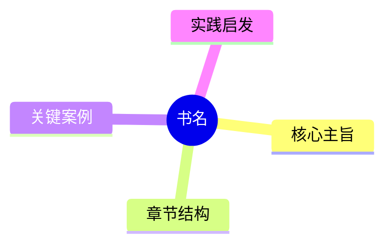

# 思维导图方案设计

**当前状态：** 已完成
**任务组标识：** 2026-04-14-读书工作台简述与导图
**所属总览：** docs/superpowers/specs/2026-04-14-读书工作台简述与导图-总览-设计-已完成.md
**所属批次：** 批次02
**前置任务：** docs/superpowers/specs/2026-04-14-读书工作台简述与导图-批次01-任务01-书籍简述提示词收口-设计-已完成.md
**并行开发：** 需等待前置任务完成
**对应工作区：** .worktrees/2026-04-14-读书工作台简述与导图-批次02-任务01-思维导图方案设计-设计/
**工作区状态：** 未创建
**执行阶段：** 已完成
**当前负责会话：** 无

## 设计结论

“让 NotebookLM 生成 Mermaid，再像 Typora 一样在网页里直接展示”这条路能做，但不能天真到以为贴个渲染器就万事大吉。最合理的主方案仍然是：让 NotebookLM 生成受约束的 Mermaid `mindmap` 代码块，前端做只读渲染和错误回退；如果 Mermaid 质量不稳定，次选是让模型输出受约束的层级 Markdown/JSON，再由前端自己转成导图。直接押 NotebookLM 原生 `mind_map artifact` 依旧不推荐做 `/book` 主路径。

## 可行性判断

可以实现，但推荐把它理解成“受约束的只读导图渲染”，不是“像 Typora 那样无脑把模型输出丢进前端就自动变图”。当前仓库只有 Markdown 渲染链，没有 Mermaid 或 Markmap 执行链；同时现有 `mind_map` artifact 规格已经确认 NotebookLM SDK 侧只能稳定拿到 metadata。也就是说，真正可落地的主路径只能是：把导图内容作为普通总结产物的一部分生成出来，再由前端自主解析和渲染。

## 范围边界

本任务只输出：

- Mermaid 方案是否可行
- 主要问题与失败模式
- 比“直接渲染 Mermaid”更稳妥的备选方式
- 后续如果要做，实现边界应怎么收

本任务不实现：

- 不新增页面按钮
- 不接入 Mermaid 或 markmap 依赖
- 不修改前后端代码

## 验证方式与成功标准

- 明确回答“这样能实现吗”
- 明确列出至少 3 个主要问题或约束
- 明确给出推荐方案、次选方案和不推荐方案
- 结论与现有仓库方向一致，不凭空发明一条更差的新路

## 主要问题与失败模式

1. **模型输出稳定性差**

- Mermaid `mindmap` 语法对缩进、层级和 fenced code block 边界都很敏感。
- NotebookLM 很容易混入解释性文字、把 `mindmap` 写成 `graph TD`，或者在节点文本里塞进符号导致解析失败。
- 如果不做代码块提取和 `mermaid.parse()` 校验，前端会时好时坏，用户只会觉得这功能像抽卡。

2. **当前前端没有图形渲染链路**

- `client/src/utils/markdown.ts` 现在只负责 Markdown -> sanitized HTML。
- `BookSummaryPanel.vue` / `ReportDetailPanel.vue` 也只会显示 Markdown 或 metadata 卡片，没有任何 Mermaid/Markmap 执行能力。
- 所以这不是“补个按钮”级别，而是要新增专门的导图渲染组件、异步渲染状态和失败回退视图。

3. **原生 `mind_map artifact` 现在不靠谱**

- 现有规格 `2026-04-09-Studio产物全量持久化与预览集成` 已明确：SDK 侧当前更像只有 metadata + experimental 标记，暂时拿不到真实可渲染结构。
- 直接接这条链路，极大概率得到“状态 ready，但前端没有图”。这种功能和没做没区别，只是多了个失败入口。

4. **大书导图可读性会迅速失控**

- 一本书的章节、概念、案例一多，Mermaid `mindmap` 很容易横向炸开，手机端尤其难看。
- Typora 那种“本地文档查看器里顺手渲染一下”的容错条件，不等于你的网页工作台也能无脑照搬。
- 如果没有缩放、滚动边界和降级视图，用户得到的不是导图，是一团 SVG 盆栽。

5. **安全边界不能偷懒**

- 模型生成的 Mermaid 文本本质上是不可信输入。
- 即便 Mermaid 最终输出 SVG，也不能跳过语法校验、渲染失败捕获和只读容器隔离。
- 否则这条链路会把“模型胡写”和“前端执行”硬绑在一起，出问题时很难定位。

## 现成方案探索

### 推荐：Mermaid

- npm 元数据：`mermaid@11.14.0`，`2026-04-01` 仍在更新，MIT。
- Context7 文档明确提供 `mermaid.parse(text)` 语法校验与 `mermaid.render(id, text)` 浏览器渲染 API。
- 这条路最适合“让 NotebookLM 直接输出 Mermaid 代码块，然后前端做只读渲染”的 MVP。

### 次选：Markmap

- npm 元数据：`markmap-view@0.18.12`，`2025-06-12` 仍在更新，MIT。
- 它更适合“模型输出层级 Markdown / 列表 / 标题结构，再由前端转换成导图”，而不是直接消费 Mermaid。
- 优点是对模型更宽容；缺点是要改 prompt 产物格式，并增加 Markdown -> tree 的转换链路。

### 淘汰：NotebookLM 原生 `mind_map artifact`

- 当前仓库自己的规格已经给出否决理由：SDK 侧只有 metadata 级信息，没有足够稳定的结构化导图数据。
- 继续押这条路，不叫复用现成能力，叫把不确定性包进产品里让用户替你验收。

## 推荐实现路径

### 方案 A：短期主推荐

1. 新增一个书籍导图 preset，让 NotebookLM 输出受约束的 Markdown，核心部分必须包含一个 fenced code block：

```markdown

```

2. 前端在书籍总结详情里提取 Mermaid 代码块。
3. 先用 `mermaid.parse()` 验证，再用 `mermaid.render()` 渲染 SVG。
4. 校验失败时不报废整个总结，而是回退显示“结构化大纲 / 原始 Markdown”。

这条路适合最快做出能看的 MVP，而且和当前“总结以 Markdown 为主”的持久化方式兼容最好。

### 方案 B：更稳的长期方案

1. 不让模型直接写 Mermaid 语法，而是输出结构化树：Markdown 层级列表或 JSON 节点数组。
2. 前端根据这份结构去渲染成导图。
3. 渲染层可以选 Markmap，也可以后续替换成自己的 tree/mindmap 组件。

这条路比方案 A 稳，因为它把“内容生成”和“图形语法”拆开了。代价是前端要多承担一次转换，前期实现会更重一点。

## 不推荐方案

- 不推荐直接把 NotebookLM 原生 `mind_map artifact` 当 `/book` 主方案。
- 不推荐让模型任意输出图形代码后前端直接插进 DOM，不做提取、校验和回退。
- 不推荐把 `graph TD` 当默认格式。它是流程图语义，不是书籍导图语义，凑合能画，不够对题。

## 自审结果

- 已把本任务限定为路线判断，不假装顺手就能把思维导图功能做完。
- 已保留稳定 worktree 映射，但由于当前只做设计结论，不提前创建工作区。
- 已明确区分“短期最快可做”和“长期更稳更好”，不拿一个看似优雅的答案糊弄成万能方案。
