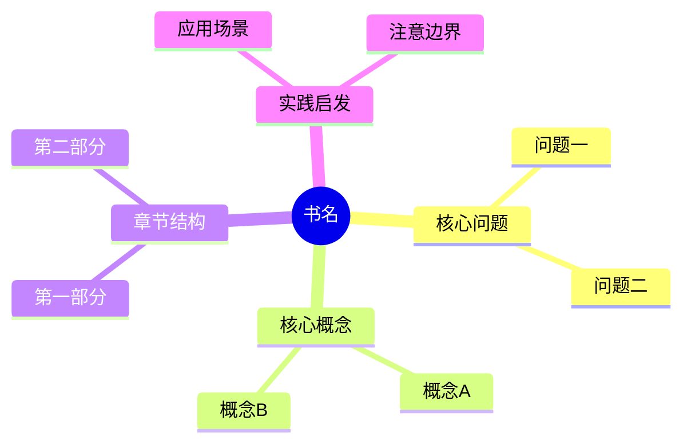

# 读书工作台详细解读入口与思维导图路线设计

**当前状态：** 已完成
**任务组标识：** 2026-04-14-读书工作台详细解读入口与思维导图路线
**对应工作区：** .worktrees/2026-04-14-读书工作台详细解读入口与思维导图路线-设计/
**工作区状态：** 未创建
**执行阶段：** 已完成
**当前负责会话：** 无

## 设计结论

`/book` 右栏不再保留“快速读书说明卡 + 单按钮”这类外强中干的包装，而是直接收口成阅读操作区：保留 `快速读书`，在其下新增 `详细解读`，两者都走同一条 `POST /api/notebooks/:id/report/generate` 链路，只靠不同的内置 preset 区分提示词。`思维导图` 本轮不做空按钮，路线先明确为“优先让 NotebookLM 生成 Mermaid `mindmap` 文本，再由前端本地渲染”；不把 NotebookLM 原生 `mind_map artifact` 当当前主方案。

## 背景判断

- 当前右栏 `快速读书` 外层说明卡已经没有信息增量，只是在重复按钮含义，视觉上占地，交互上没贡献。
- `详细解读` 与 `快速读书` 的差别本质上不是链路不同，而是输出密度、组织方式和关注点不同；强行另开接口纯属自己给自己加税。
- 现有 `summary_presets`、`presetId` 和 `/report/generate` 已经足够承载第二种单书总结模式，继续复用是最小正确改动。
- 思维导图这件事最忌讳“先加按钮，后想数据”。仓库里现有 `mind_map` 规格已明确写出：NotebookLM 当前更像只能稳定给 metadata，暂时拿不到可渲染的结构树。现在就把它接成主路径，极大概率做成状态有了、图没了的废功能。

## 范围边界

本次实现：

- 移除右栏 `快速读书` 外层说明卡样式，改为更直接的阅读操作区
- 保留 `快速读书` 按钮
- 在 `快速读书` 按钮下新增 `详细解读` 按钮
- 新增内置 preset：`builtin-deep-reading`
- `详细解读` 复用 `POST /api/notebooks/:id/report/generate`，只通过 `presetId` 区分输出提示词
- 让 `/book` 的总结列表同时纳入 `builtin-quick-read` 与 `builtin-deep-reading`
- 明确本轮思维导图路线结论，并写入规格

本次不实现：

- 不在本轮落地 `思维导图` 的按钮、渲染器或预览页
- 不改造 NotebookLM Studio 的 `mind_map artifact` 链路
- 不把 `详细解读` 做成新的独立接口或新的页面

## 推荐实现

### 1. 右栏操作区收口

- `BookActionsPanel.vue` 去掉当前外层说明卡容器，改成更简洁的纸页式按钮区
- 保留短说明，但不再把说明和按钮包装成“独立卡片里再套按钮”的结构
- 按钮顺序固定为：`快速读书`、`详细解读`

### 2. 详细解读走 preset 复用链路

- `client/src/api/book-summary.ts` 不再只有 `generateBookSummary()` 一个硬编码入口，而是抽成可传 presetId 的轻量封装
- `server/src/db/index.ts` 增加 `builtin-deep-reading` 的内置 seed
- `server/src/routes/notebooks/index.ts` 对“Book 页可直接生成”的特殊门槛，不再只放行 `builtin-quick-read`，而是放行 Book 专用 preset 集合：`builtin-quick-read`、`builtin-deep-reading`
- `book-center.ts` 的“书籍总结列表”筛选逻辑也同步纳入 `builtin-deep-reading`

### 3. 详细解读提示词方向

`详细解读` 不该只是“快速读书多写一点”，而应明确拉开输出意图：

- 强调逐章展开与论证脉络，而不是概览式速读
- 强调作者论证结构、关键概念之间的关系、章节推进逻辑
- 强调适用场景、局限、争议点、可迁移方法
- 要求输出更充分，但仍必须只基于当前书籍来源，不得混入既有聊天历史

推荐提示词结构：

1. 这本书试图解决什么问题，作者核心判断是什么
2. 全书结构拆解：按部分/章节说明主题推进关系
3. 关键概念、模型、方法：逐项解释其定义、作用、前提和边界
4. 重点章节精读：挑最关键章节做更细的观点、论据、案例拆解
5. 作者论证链路：结论如何被建立，证据来自哪里，还缺什么
6. 实践价值：哪些人最该读、能直接拿去用什么、容易误用什么
7. 局限与批判阅读：哪些前提可能不成立，哪些结论需要谨慎吸收

### 4. 思维导图路线结论

本轮只定路线，不落代码。推荐顺序：

1. **主推荐：** 让 NotebookLM 生成 ` ```mermaid ...``` ` 的 `mindmap` 文本，再由前端用 Mermaid 本地渲染
2. **次选：** 若后续验证 Mermaid `mindmap` 生成质量不稳定，可退回让 NotebookLM 输出结构化 Markdown 层级，再由 `markmap` 渲染
3. **不推荐当前直接采用：** NotebookLM 原生 `mind_map artifact` 作为 `/book` 主路径，因为现有仓库结论已说明它当前更像 metadata-only

推荐 Mermaid mindmap 产物格式：



不推荐把 `graph TD` 当默认格式。它能画，但语义上更像流程图而不是书籍结构导图，属于能凑活，不够对题。

## 涉及文件或模块

- `docs/superpowers/specs/2026-04-14-读书工作台详细解读入口与思维导图路线-设计-已完成.md`
- `client/src/components/book-workbench/BookActionsPanel.vue`
- `client/src/components/book-workbench/book-actions.ts`
- `client/src/components/book-workbench/book-actions.test.ts`
- `client/src/api/book-summary.ts`
- `client/src/api/book-summary.test.ts`
- `client/src/components/book-workbench/book-center.ts`
- `client/src/components/book-workbench/book-center.test.ts`
- `client/src/views/BookWorkbenchView.vue`
- `client/src/views/book-workbench-view.test.ts`
- `server/src/db/index.ts`
- `server/src/routes/notebooks/index.ts`
- `server/src/routes/notebooks/index.test.ts`

## 验证方式与成功标准

- `/book` 右栏不再保留当前“快速读书说明卡”外包装
- `快速读书` 下方出现 `详细解读` 按钮
- `详细解读` 与 `快速读书` 共用 report 生成接口，但提交不同 `presetId`
- `builtin-deep-reading` 在数据库 seed 中存在
- Book 页的“书籍总结”列表可同时看到快速读书与详细解读生成结果
- `builtin-deep-reading` 与 `builtin-quick-read` 一样，在有书无历史问答时可直接生成
- 规格已明确思维导图后续路线：优先 Mermaid `mindmap`，不是当前直接押 NotebookLM 原生 `mind_map artifact`

## 自审结果

- 已把“详细解读实现”和“思维导图路线决策”放在同一单任务规格里，因为当前只有一个直接可执行任务；思维导图仅输出路线，不单独拆任务
- 已明确本轮不做思维导图按钮，避免先造入口再补能力的伪推进
- 已把 `详细解读` 设计成 preset 复用，而不是额外接口，保持实现最小化
- 已明确不推荐 `graph TD` 作为默认导图格式，避免后续产出风格跑偏
